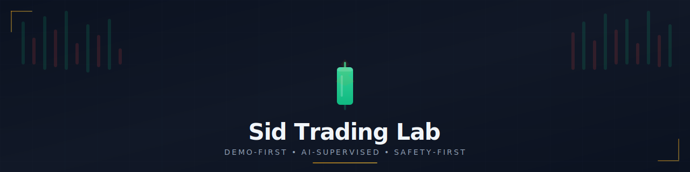
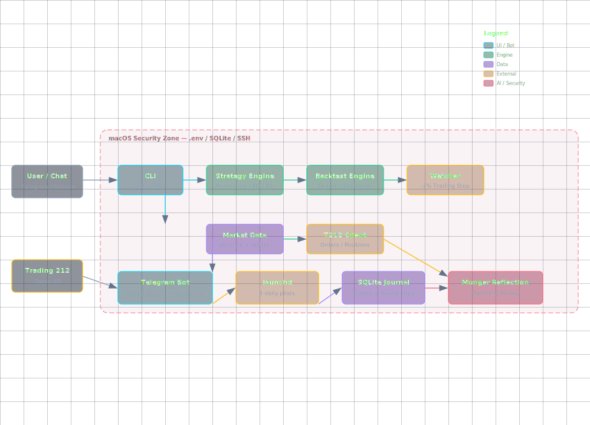

<div align="center">
  
  <br><br>

  <!-- Badges Row -->
  
  
  
  
  
  
  <br><br>

  <p><em>A demo-first, AI-supervised trading research lab with scheduled routines, position watching, and multi-platform alerts.</em></p>
</div>

---

## 📕 Table of Contents

- [Overview](#-overview)
- [Key Features](#-key-features)
- [System Architecture](#-system-architecture)
- [Safety Guardrails](#-safety-guardrails)
- [Quick Start](#-quick-start)
- [Commands & Routines](#-commands--routines)
- [Technology Stack](#-technology-stack)
- [Screenshots](#-screenshots)
- [Contributing](#-contributing)
- [License](#-license)

---

## 📈 Overview

**Sid Trading Lab** is a disciplined research environment for building, backtesting, and paper-trading simple strategies against the Trading 212 **demo** environment.

> ⚠️ **This is NOT an autonomous trading bot.** All execution is supervised — AI generates signals, humans review, demo executes.

### Philosophy

| Principle | Implementation |
|---|---|
| 🔒 **Demo-first** | `T212_ENV=demo` hard-coded for first 30 days |
| 🤖 **AI-supervised** | GPT-4 / Claude sparring partner for every signal |
| 📖 **Decision journal** | Every trade logged to SQLite + GitHub |
| 🚨 **Safety-first** | Hard limits: max 10 positions, 20% per position, -7% stop |
| 📢 **Multi-platform** | Telegram bot + Discord bot + launchd scheduled routines |

---

## ✨ Key Features

<div align="center">

| 🔗 **Trading Engine** | 📊 **Backtesting** | 🤖 **AI Agents** | 📢 **Alerts** |
|:---|:---|:---|:---|
| 3 strategies (Momentum, MA, RSI) | Sharpe, CAGR, drawdown, win rate | Signal review + Munger reflection | Telegram + Discord bots |
| T212 demo broker integration | yfinance / CSV / static data | Position watcher with trailing stops | Scheduled launchd routines |
| GTC orders with -7% stop | ASCII equity sparklines | Auto-approve demo orders | HTML-escaped rich messages |
| SQLite journaling | Parameter sweep engine | Cash/portfolio scorer | 5 daily cron jobs |

</div>

### 📅 Scheduled Routines (EST)

| Time | Routine | Action |
|---|---|---|
| 06:00 | Pre-market | Research overnight catalysts, scan opportunities |
| 09:30 | Market open | Execute planned trades, set stops |
| 12:00 | Midday | Review positions, cut losers, tighten stops |
| 16:00 | Market close | EOD summary, journal trades |
| Fri 17:00 | Weekly review | Full portfolio analysis, strategy adjustments |

---

## 🏗️ System Architecture

<div align="center">
  <a href="docs/assets/architecture-diagram.html">
    
  </a>
  <br>
  <em>Click to open interactive HTML diagram</em>
</div>

### Architecture Highlights

- **PTB JobQueue** — Single event loop for bot + scheduled jobs (no threading conflicts)
- **launchd plists** — 5 macOS LaunchAgents for time-based routines
- **SQLite journaling** — Round-trip tracking, P&L, failure alerts
- **Position Watcher** — Auto trailing stop at -7% with Telegram alerts
- **Munger Reflection** — Weekly AI critique of decisions and emotional bias

---

## 🚨 Safety Guardrails

<div align="center">
  
  
  
  
  
  
</div>

### Non-negotiable Rules

```text
T212_ENV=demo            # Always demo
T212_ALLOW_LIVE=false    # Live blocked by default
ORDER_PLACEMENT=false    # Requires manual enable
MAX_POSITIONS=10         # Hard cap
MAX_PER_POSITION=20%     # Concentration limit
MIN_CASH=10%             # Reserve requirement
TRAILING_STOP=-7%        # Auto cut losers
NO_OPTIONS=true            # Stocks only
NO_LEVERAGE=true           # No margin
NO_SHORT=true              # Long only
NO_PENNY=true              # $5 minimum
MAX_NEW_PER_WEEK=3       # Pace of entry
```

---

## 🚀 Quick Start

### Prerequisites

- macOS with Python 3.14+
- Trading 212 **DEMO** API key ([get one here](https://helpcentre.trading212.com/hc/en-us/articles/16873747222804))
- Telegram bot token from @BotFather

### Setup

```bash
# 1. Clone and enter
cd ~/Projects
git clone https://github.com/amonkarsidhant/TradingLab.git
cd TradingLab

# 2. Create virtual environment
python3.14 -m venv .venv
source .venv/bin/activate

# 3. Install
pip install -r requirements.txt
pip install -e .

# 4. Configure
cp .env.example .env
# Edit .env with your T212 DEMO credentials + TELEGRAM_BOT_TOKEN

# 5. Verify
pytest
python -m trading_lab.cli account-summary
```

### Running the Unified Bot

```bash
# Start the unified Telegram bot daemon
python scripts/telegram_bot_unified.py

# Or load via launchd (runs on boot + auto-restart)
launchctl bootstrap gui/501 ~/Library/LaunchAgents/com.sidtradinglab.unifiedbot.plist
```

---

## 📜 Commands & Routines

### CLI Commands

```bash
python -m trading_lab.cli account-summary     # Demo account overview
python -m trading_lab.cli positions             # Current positions
python -m trading_lab.cli run-strategy --strategy simple_momentum --ticker AAPL --dry-run
python -m trading_lab.cli backtest --strategy ma_crossover --data-source yfinance
python -m trading_lab.cli review-signal --strategy simple_momentum --data-source static
```

### Telegram Bot Commands

| Command | Description |
|---|---|
| `/status` | Account summary + cash position |
| `/positions` | Live positions with P&L |
| `/scan` | Full watchlist scan |
| `/buy TICKER QTY` | Place demo buy order |
| `/sell TICKER QTY` | Place demo sell order |
| `/jobs` | List scheduled routines |
| `/run_job NAME` | Manually trigger a routine |
| `/journal` | Generate trading journal |
| `/weekly` | Weekly Munger reflection |
| `/dashboard` | Local dashboard URL |
| `/help` | Full command reference |

---

## 🛠️ Technology Stack

<div align="center">

| Category | Tools |
|---|---|
| **Language** | Python 3.14 |
| **CLI Framework** | Typer + Rich |
| **Broker API** | Trading 212 REST API |
| **Data Sources** | yfinance, CSV, static |
| **Database** | SQLite (journals + cache) |
| **Bot Framework** | python-telegram-bot (PTB) v22 |
| **Scheduling** | launchd + PTB JobQueue |
| **Discord** | discord.py |
| **Testing** | pytest |
| **Deployment** | macOS launchd |

</div>

---

## 🖼️ Screenshots

*Coming soon — dashboard screenshots, backtest reports, and bot interaction examples.*

---

## 👨‍🔬 Contributors

<div align="center">
  <table>
    <tr>
      <td align="center">
        <a href="https://github.com/amonkarsidhant">
          <br/>
          <sub><b>Sidhant Amonkar</b></sub>
        </a><br/>
        <sub>Author & Architect</sub>
      </td>
      <td align="center">
        <a href="https://github.com/features/copilot">
          <br/>
          <sub><b>Claude / GPT-4</b></sub>
        </a><br/>
        <sub>AI Co-authors</sub>
      </td>
    </tr>
  </table>
</div>

---

## 🤝 Contributing

See [CONTRIBUTING.md](CONTRIBUTING.md) for guidelines.

Quick contributions welcome:
- 📜 Documentation improvements
- 🐛 Bug fixes
- 🎲 New strategies (with backtests)
- 🎨 UI / dashboard enhancements

---

## 📜 License

MIT License — see [LICENSE](LICENSE) for details.

> **Disclaimer:** This is a learning experiment. No real money is at risk. Past performance of backtests does not guarantee future results. Use at your own risk.

---

<div align="center">
  <br>
  
  <br><br>
  <sub><em>Sid Trading Lab — Demo-First AI-Supervised Trading Lab</em></sub>
</div>
